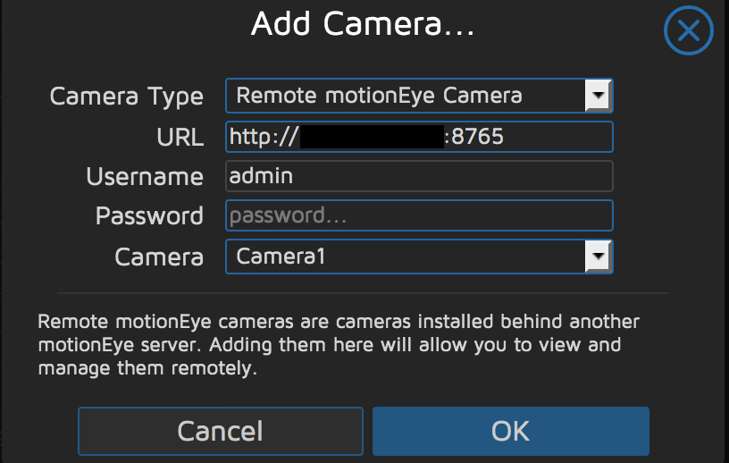

# motionEye for Docker

A container that runs motionEye for use on your home network. Runs on port `8765`, the default username is `admin` and the password is blank.

Run in the foreground for testing:

```bash
docker run -it -p 8765:8765 -p 7999:7999 aphexddb/motioneye:latest
```

View on your docker host [http://localhost:8765](http://localhost:8765).

When you are up and running, in order to save videos you will need to mount the media directory to your local filesystem. Do so by mounting `/var/lib/motioneye` as follows:

```bash
mkdir -p /tmp/motioneye
docker run -d -p 8765:8765 -p 7999:7999 -v /tmp/motioneye:/var/lib/motioneye aphexddb/motioneye:latest
```

## Adding cameras

To add a motioneye camera, enter the IP and port:


